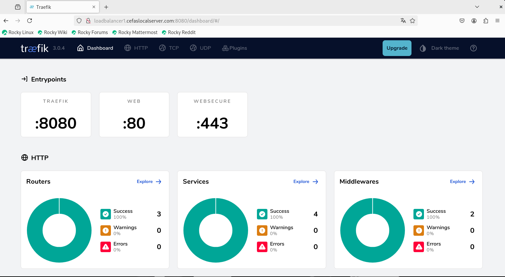
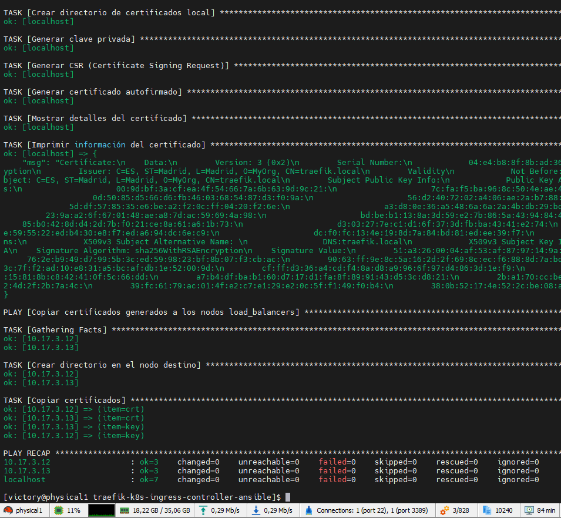
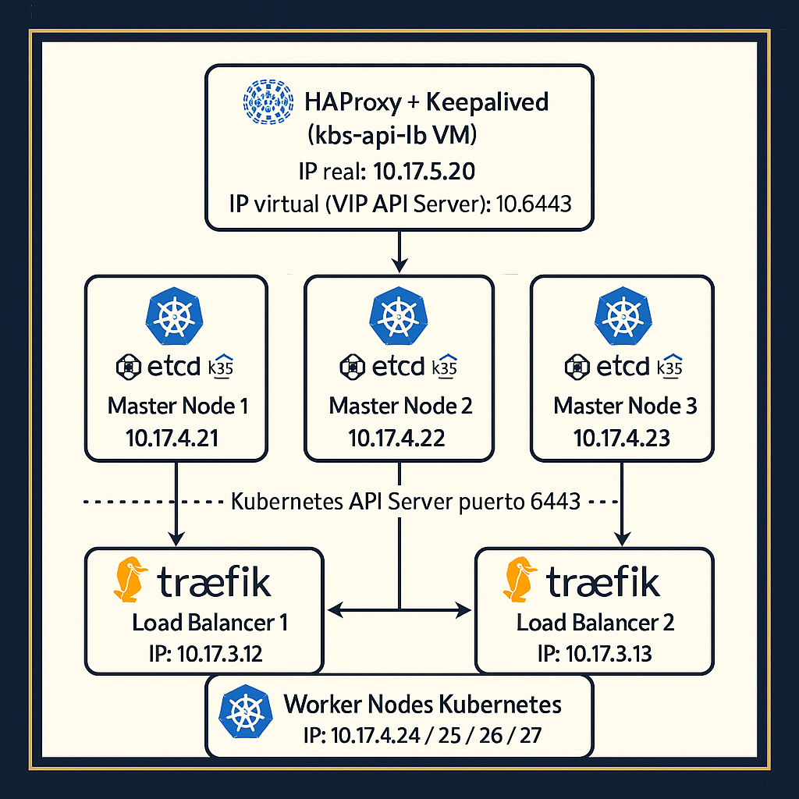

# Traefik Kubernetes Ingress Controller con Ansible

Este repositorio contiene configuraciones y scripts para implementar y gestionar un balanceador de carga eficiente basado en **Traefik** utilizando **Docker Compose** dentro de un entorno Kubernetes. El objetivo principal es facilitar la instalación y configuración de **Traefik** como proxy inverso y balanceador de carga en un nodo dedicado (`loadbalancer1`), optimizado para gestionar nodos maestros, trabajadores y otros servicios de red.

## Características

- **Balanceador de Carga**: Implementación de Traefik para gestionar el tráfico hacia los nodos del clúster Kubernetes.
- **Proxy Inverso**: Soporte para enrutar peticiones a servicios específicos dentro del clúster.
- **Configuración Modular**: Incluye plantillas para archivos de configuración (`traefik.toml` y `docker-compose.yml`).
- **Compatibilidad con Certificados SSL**: Integración de Let’s Encrypt para certificados automáticos.
- **Gestión Simplificada**: Uso de Ansible para instalar y configurar todo el entorno.

## Requisitos Previos

Antes de usar este repositorio, asegúrate de cumplir con los siguientes requisitos:

1. **Nodo LoadBalancer**:
   - Rocky Linux 9 o equivalente.
   - Conexión SSH habilitada.
   - Docker y Docker Compose instalados (el repositorio incluye su instalación automatizada).
   
2. **Clúster Kubernetes**:
   - Nodos maestros y trabajadores configurados.
   - Servicio DNS en funcionamiento (por ejemplo, FreeIPA).

3. **Dependencias**:
   - Ansible instalado en tu máquina de control.
   - Acceso SSH configurado hacia el nodo `loadbalancer1`.

## Instalación y Uso

1. **Clonar el Repositorio**:

   ```bash
   sudo git clone https://github.com/vhgalvez/kubernetes-infra-automation.git
   cd kubernetes-infra-automation
   ```

2. **Configurar el Inventario**:

   Edita el archivo `inventory/hosts.ini` para incluir los detalles del nodo `loadbalancer1` y otros nodos relevantes.

   ```ini
   [loadbalancer]
   loadbalancer1 ansible_host=10.17.3.12 ansible_user=core ansible_ssh_private_key_file=/ruta/a/tu/clave_privada
   loadbalancer2 ansible_host=10.17.3.13 ansible_user=core ansible_ssh_private_key_file=/ruta/a/tu/clave_privada
   ```

3. **Ejecutar el Playbook**:

   Usa el siguiente comando para instalar y configurar Traefik:

   ```bash
   sudo ansible-playbook -i inventory/hosts.ini ansible/playbooks/install_traefik.yml
   ```


### 2️⃣ Instalar y Configurar Traefik con los Certificados

Una vez que los certificados estén listos, puedes instalar y configurar **Traefik** con el siguiente playbook:

```bash
sudo ansible-playbook -i inventory/hosts.ini ansible/playbooks/install_traefik.yml
```
### Resetear el entorno de Traefik


Si necesitas reiniciar el entorno de Traefik, puedes usar el siguiente comando:

```bash
sudo ansible-playbook -i inventory/hosts.ini ansible/playbooks/reset_traefik_env.yml
```

### 3️⃣ Verificar el Estado de Traefik

Una vez finalizada la ejecución, accede al dashboard de Traefik para verificar la configuración:

```
http://loadbalancer1.cefaslocalserver.com:8080/dashboard/
```

## Personalización

- **Configuración de Traefik**:
  Modifica las plantillas en `templates/traefik.toml.j2` y `templates/docker-compose.yml.j2` según tus necesidades.

- **Certificados SSL**:
  Asegúrate de configurar correctamente el email para Let's Encrypt en `traefik.toml.j2`.

## Problemas de Resolución DNS

Si `whoami.localhost` no se resuelve, añade esta entrada al archivo `/etc/hosts` en tu máquina cliente:

```plaintext
10.17.3.12 whoami.localhost
```
---

## Traefik jwt token

[Traefik jwt token](https://github.com/vhgalvez/traefik-k8s-ingress-controller-ansible/blob/main/docs/traefik_jwt.md)


---

## Traefik dashboard




### Playbook de Ansible traefik instalacion OK




---

### Diagrama de la Infraestructura de Balanceo de Carga controlador de Ingress




```bash
                     +-------------------------------------------------+
                     | HAProxy + Keepalived (k8s-api-lb VM)            |
                     | IP real: 10.17.5.20                             |
                     | IP virtual (VIP API Server): 10.17.5.10:6443    |
                     +-------------------------------------------------+
                                          |
                                          v
                        +-----------------+-------------------+
                        |                 |                   |
                        v                 v                   v
            +---------------+   +---------------+   +---------------+
            | Master Node 1 |   | Master Node 2 |   | Master Node 3 |
            |  (etcd+k3s)   |   |  (etcd+k3s)   |   |  (etcd+k3s)   |
            | 10.17.4.21    |   | 10.17.4.22    |   | 10.17.4.23    |
            +---------------+   +---------------+   +---------------+

 (Kubernetes API Server puerto 6443)───────────────────────────┐
                                                               │
───────────────────────────────────────────────────────────────┼────────────────
                                                               │ (Consulta API)
                                                               v
                  +----------------------------+-----------------------------+
                  |                                                          |
                  v                                                          v
      +-------------------------+                               +-------------------------+
      | Load Balancer 1 Traefik |                               | Load Balancer 2 Traefik |
      |    IP: 10.17.3.12       |                               |    IP: 10.17.3.13       |
      | (Ingress Controller)    |                               | (Ingress Controller)    |
      +-------------------------+                               +-------------------------+
                  |                                                          |
                  v                                                          v
      +---------------------------------------------------------------+
      |                 Worker Nodes Kubernetes                       |
      |                 IP: 10.17.4.24 / 25 / 26 / 27                 |
      +---------------------------------------------------------------+
```

## Contribuciones

¡Las contribuciones son bienvenidas! Si encuentras algún problema o tienes sugerencias de mejora, abre un issue o envía un pull request.

## Licencia

## 📜 Licencia este proyecto está licenciado bajo la **Licencia MIT** [LICENSE](LICENSE).

## Autor

Desarrollado por [Victor Gálvez](https://github.com/vhgalvez) como parte de la implementación de entornos Kubernetes altamente escalables y gestionados.


> Proyecto independiente para usarse como prerequisito en arquitecturas como [FlatcarMicroCloud](https://github.com/vhgalvez/FlatcarMicroCloud)


mv group_vars/load_balancers/vault.yml group_vars/load_balancers/main.yml


sudo ansible-vault create group_vars/load_balancers/vault.yml

 
sudo ansible-vault edit group_vars/load_balancers/vault.yml


traefik_dashboard_htpasswd: "admin:e10adc3949ba59abbe56e057f20f883e"

sudo ansible-playbook -i inventory/hosts.ini ansible/playbooks/install_traefik.yml --ask-vault-pass


traefik_dashboard_htpasswd: |
  admin:$apr1$K7NbnfJf$phKUBJeoyOaEFZx3AH8Mu.
